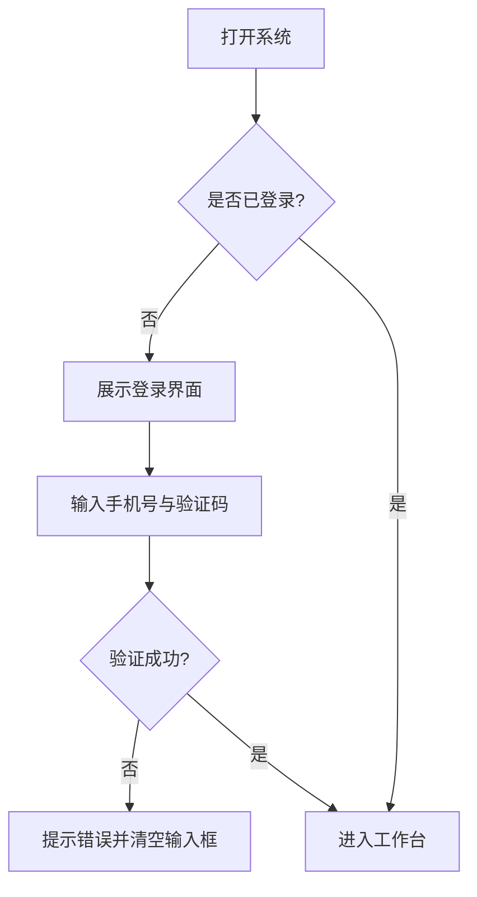

# 敏捷产品经理需求产出工作流 (Agile PM Workflow)
## 触发方式
当用户提供一个初步的想法或需求描述时，请严格按照以下**七个步骤**引导用户。
**🚨 绝对强制指令：你必须一步一步（Step-by-Step）执行！绝不允许一次性输出所有步骤的结果。在每一个带有【等待用户确认】的步骤结束后，你必须停止输出，等待用户的回答！**

---

## 步骤一：对话式需求采集与确认

新手往往难以一次性说清需求。AI 应首先采用「灵活对话式」引导，主动评估、温和追问、并进行总结确认。在需求未明确前，**不要急于创建文件或文件夹**。

### 1.1 接收需求
- 接受用户的任意形式输入（一句话、截图、草图、大白话）。
- **不要**要求用户填写复杂的固定模板，降低认知门槛。

### 1.2 核心维度评估与反馈
当你接收到用户的初步需求后，**必须将以下 7 个关键维度的评估结果直接展示给用户**，告诉他们当前需求在哪些维度是清晰的，哪些是缺失的：
1. **背景/痛点**：为什么要做？现状有什么问题？（必须）
2. **业务目标**：做完后想达到什么效果？（必须）
3. **用户与场景**：谁在什么具体情况下使用？（必须）
4. **核心用户旅程**：用户从接触到完成目标的关键路径是怎样的？中间有什么触点和痛点？（必须）
5. **现有方案**：现在他们是怎么解决这个问题的？（重要）
6. **业务规则**：有哪些必须遵守的限制或特定流程？（重要）
7. **参考/竞品**：有没有喜欢的对标产品？（加分项）

### 1.3 需求复杂度评估（智能模式切换）🆕
在进行深度追问前，AI 必须根据初步需求评估其复杂度，并**向用户明确展示评估结果与推荐的工作流模式**：

#### 复杂度判断标准
- **简单需求**：单一功能优化、文案修改、单页面调整、bug 修复等。特征：影响范围小（1-2个页面/模块）、逻辑清晰、无需复杂用户旅程。
- **标准需求**：新增完整功能模块、优化某条业务主线、中等规模的迭代。特征：涉及 3-5 个页面、需考虑用户旅程、有一定业务规则。
- **复杂需求**：多模块系统、平台级产品、跨角色协作流程。特征：多个子系统、复杂的角色权限、需要深度业务建模。

#### 模式推荐与流程调整
**简单需求 - 快速模式**：
- 追问轮数：2 轮
- 步骤简化：跳过步骤三（初版 PRD），直接从步骤四（原型）开始，原型确认后直接产出最终 PRD
- 设计系统：可选（若已有设计规范或仅微调，可跳过 UI/UX Pro Max + Impeccable）
- 适用场景：改个按钮样式、调整提示文案、修复单页面 bug

**标准需求 - 标准模式**（默认）：
- 追问轮数：3 轮
- 完整流程：步骤一 → 步骤二 → 步骤三（初版 PRD）→ 步骤四（原型）→ 步骤五（流程图）→ 步骤六（最终 PRD）→ 步骤七（版本管理）
- 设计系统：推荐执行 UI/UX Pro Max + Impeccable
- 适用场景：新增用户注册流程、优化购物车、新增数据看板

**复杂需求 - 深度模式**：
- 追问轮数：5 轮
- 流程增强：在步骤三后增加"模块拆解"环节，为每个子模块独立产出原型，最后统一整合
- 设计系统：强制执行 UI/UX Pro Max + Impeccable，并需要设计系统持久化（`--persist`）
- 适用场景：电商平台 MVP、ERP 系统、多端协同产品

#### 模式展示与确认 【等待用户确认】
AI 必须向用户展示评估结果，格式如下：

> 📊 **需求复杂度评估**
> 
> 根据您的描述，我判断这是一个 **[简单/标准/复杂] 需求**。
> 
> **推荐模式**：[快速/标准/深度] 模式
> - 追问轮数：[2/3/5] 轮
> - 流程路径：[简化/完整/增强] 流程
> - 预计耗时：[15 分钟/45 分钟/2 小时]
> 
> **您可以选择**：
> 1. ✅ 接受推荐（直接回复"确认"或"开始"）
> 2. 🔄 切换模式（回复"我想用标准模式"或"用深度模式"）
> 3. 📝 先看详细说明（回复"详细说明"）

用户确认模式后，进入对应的追问环节。

### 1.4 深度追问与多轮确认 【等待用户确认】
**根据用户选择的模式，执行对应轮数的启发式追问。**

**通用追问规则**：
- **追问方式**：抛弃死板的选项（A/B/C），采用**开放式、启发式**的提问，引导用户多方面、更全面地思考这个需求。
- **追问数量**：每次追问必须在 **3 到 5 个问题**之间。
- **循环机制**：基于用户的上一次回答，挖掘出新的盲点继续追问。
- **最终确认**：只有当你通过多轮追问**完全理解**了需求的所有细节，并且用户明确表示"没有补充了，可以开始写了"之后，你才能进行结构化复述并进入下一步。
- **🛑 强制暂停：在每一轮提问后必须停止输出！等待用户回复后才能进行下一轮动作。**

**快速模式（2 轮追问）**：
- 第 1 轮：聚焦核心触发场景和预期结果（如"用户点这个按钮后应该看到什么？"）
- 第 2 轮：确认异常情况处理（如"如果网络断了 / 权限不足 / 数据为空，怎么提示？"）

**标准模式（3 轮追问）**：
- 第 1 轮：核心场景与目标
- 第 2 轮：用户旅程与痛点
- 第 3 轮：业务规则与异常处理

**深度模式（5 轮追问）**：
- 第 1 轮：宏观背景与商业目标
- 第 2 轮：多角色用户旅程
- 第 3 轮：核心业务规则与数据模型
- 第 4 轮：跨模块协作与边界
- 第 5 轮：技术约束与演进规划

---

## 步骤二：项目初始化与目录架构搭建

在需求确认无误，准备开始产出文档之前，必须先帮用户建立一个清晰、规范的项目文件夹结构，避免后期文件混乱。

### 2.1 建立标准目录树
主动为当前项目创建一个专属的根文件夹（如以项目名称命名），并在其中创建以下标准子目录：
- `prd/`：用于存放所有的产品需求文档（Markdown 格式，如 `prd_v1.0.md`）。
- `prototype/`：用于存放所有的高保真 HTML 原型文件。
- `flowcharts/`：用于存放独立的 Mermaid 流程图源文件（`.mmd`），方便单独维护。PRD 中的流程图直接以 Mermaid 代码块嵌入。
- `annex/`：用于存放各种附件（如原始的 Excel/CSV 数据字典、需求原始文稿、参考资料等）。
- `templates/`：用于存放工作流模板或参考文件（如 `prd_template.md`）。

### 2.2 确认架构
向用户展示创建好的目录结构，并告知后续的产出物都将分类存放在这些对应的文件夹中。

---

## 步骤三：输出"详细的第一版初步PRD"

**🚨 关键规则：初步的 PRD 也必须非常详细，不能只是一个空框架。**

### 3.0 事实边界规则（贯穿所有 PRD 产出，最高优先级）🛡️

🚨 PRD 的每一条内容只能有两个来源：
1. **用户已确认的信息**（来自步骤一的追问与复述）——直接写。
2. **AI 基于常识的合理推断**——必须显式标注 `（AI推断·待确认）`。

**绝对禁止**：把未经用户确认的**量化指标、业务规则、用户画像、数据字段**当作事实写出。

- ❌ 错误：「目标值：转化率提升 20%」（用户从没说过这个数）
- ✅ 正确：「目标值：转化率提升 _（AI推断·待确认，建议填具体数值）_」
- ✅ 正确（用户确认过则）：「目标值：转化率提升 20%」

"详细"指的是**结构和逻辑的完整**，不是**用编造的数字填满空格**。宁可留占位符，不可造假。本规则同样适用于步骤六的最终 PRD 与所有迭代版本。

### 3.1 产出内容（单一 Markdown 格式）
根据步骤一的确认信息，生成一份初步 PRD（`prd/prd_v1.0.md`，Markdown 格式）。

**Markdown 格式的优势**：
- 生成速度快，无需依赖 `python-docx` 或 HTML 渲染。
- 飞书、Notion、语雀、GitHub 等主流知识库均原生支持 Markdown 导入与渲染（含 Mermaid）。
- 纯文本格式，便于版本对比（git diff）和协作编辑。

**必须搭建好完整的文档结构骨架（参考 6.1 节的标准目录），并且必须深度填充以下部分**：
1. **项目基本信息**
2. **需求背景与目标**：必须包含四列表格（目标类型、描述、衡量指标、目标值）。
3. **用户使用场景与旅程图**：必须使用表格或清晰的结构描述用户旅程（User Journey Map），包含：阶段、用户触点、用户行为、痛点/情绪、产品机会点，要具备强烈的代入感。
4. **详细的功能清单与基础逻辑**：不能只列出模块和名称，必须详细梳理出核心的操作主线、前置条件、基本业务规则和数据流向。
*（后续章节如详细方案带原型链接的模块、整体流程图等可先留空，并注明"待原型确认后补充"）*

### 3.2 用户确认 【等待用户确认】
询问用户："这是产品的详细第一版架构和业务逻辑，您看方向和基础逻辑准确吗？如果没问题，我们将先进行【原型设计】，通过具体的画面来进一步理清交互细节和可能遗漏的功能。"
**🛑 强制暂停：在此处必须停止输出！等待用户回复同意后，才能进入步骤四。**

---

## 步骤四：产出高保真 HTML 原型 (核心验证阶段)

**这是本工作流最具特色的环节。** 新手往往在看到具体画面后，才能发现逻辑上的漏洞（如缺失的返回按钮、未考虑的空状态）。

### 4.1 原型规范
1. 产出 **单文件 HTML 原型**，包含完整的 CSS 样式。
2. 强制使用 **Tailwind CSS**，并采用现代、简洁的设计风格。
3. 必须包含关键的交互状态（如：默认页、展开弹窗、成功提示等）。可以通过简单的原生 JavaScript 或 URL Hash (`#page1`) 来实现页面切换。
4. **Hash 路由定位**：原型必须支持 URL Hash 路由（如 `prototype_v1.0.html#login`），方便 PRD 中通过链接直接跳转到对应功能页面。

### 4.2 设计系统生成与前端设计优化（推荐但可选）🆕

本工作流**推荐但不强制**使用**两阶段设计流程**，以确保从设计方向到视觉细节的全面专业化：
- **第一阶段（UI/UX Pro Max）**：确定设计方向、风格、配色、字体等核心设计系统
- **第二阶段（Impeccable Skills）**：对生成的 HTML 原型进行专业级打磨和细节优化

**何时跳过设计系统？**
- 已有明确的设计规范（如企业 Design System、品牌指南）
- 快速模式下的简单需求（如单页面微调）
- 原型仅用于内部逻辑验证，不需要高保真视觉

**何时必须使用？**
- 深度模式的复杂需求（多模块系统）
- 面向客户 / 投资人的演示原型
- 需要交付前端开发团队的设计规范

#### 4.2.0 环境探测（执行设计系统前必做）🛡️

调用设计相关指令前，AI **必须**先确认依赖是否真实可用，**不得假设已安装**：

1. **Impeccable Skills（随本仓库附带）**：检查 `/impeccable`、`/arrange`、`/typeset`、`/colorize`、`/delight`、`/polish`、`/critique` 是否可用。若不可用，通常是用户尚未把仓库里的 `impeccable_skill/` 复制到技能目录——提示其安装即可获得专业打磨。
2. **UI/UX Pro Max（独立可选项目）**：检查 `~/.claude/skills/ui-ux-pro-max/scripts/search.py` 是否存在。它**不随本仓库附带**，未安装属正常情况。

根据探测结果走对应分支：

- **Impeccable 可用** → 第二阶段（§4.2.5）打磨为**必做**。
- **UI/UX Pro Max 可用** → 第一阶段（§4.2.1）设计系统生成为推荐执行；不可用则跳过，直接进入打磨阶段。
- **两者都缺失** → 进入【降级模式】，**不要**报错卡住，也**不要**伪造脚本输出。改为告知用户：
  > ⚙️ 未检测到设计增强 Skill，已切换为「基础设计规范」生成原型：
  > 采用 Tailwind 默认色板 + 8px 间距栅格 + 单一主色 + 系统字体栈，遵循对比度、留白、视觉层级的通用原则。
  > 安装本仓库的 `impeccable_skill/` 可获得专业打磨；安装 ui-ux-pro-max 可获得完整设计系统。

  然后用基础规范产出原型，跳过缺失的指令。

#### 4.2.1 第一阶段：UI/UX Pro Max 设计系统生成（推荐执行）

如果选择使用设计系统，在原型开发前执行以下命令获取完整的设计系统推荐：

```bash
python3 ~/.claude/skills/ui-ux-pro-max/scripts/search.py "<产品类型> <行业> <关键词>" --design-system -p "项目名称"
```

**示例**：
```bash
# 美容 SPA 服务类产品
python3 ~/.claude/skills/ui-ux-pro-max/scripts/search.py "beauty spa wellness service" --design-system -p "Serenity Spa"

# AI 搜索工具产品
python3 ~/.claude/skills/ui-ux-pro-max/scripts/search.py "AI search tool modern minimal" --design-system -p "AI Search"

# 金融科技产品
python3 ~/.claude/skills/ui-ux-pro-max/scripts/search.py "fintech crypto trading" --design-system -p "CryptoTrade"
```

**设计系统输出包含**：
1. **产品模式推荐**：基于产品类型的最佳设计模式
2. **风格选择**：从 67 种 UI 风格中匹配（glassmorphism、minimalism、brutalism 等）
3. **色彩方案**：从 161 个色板中推荐适合的配色（含 Tailwind CSS 类名）
4. **字体配对**：从 57 组字体配对中推荐（含 Google Fonts 导入代码）
5. **视觉效果**：阴影、模糊、圆角等效果参数
6. **反模式警告**：需要避免的设计陷阱

#### 4.2.2 补充领域搜索（按需执行）
如需深入某个设计维度，可使用领域搜索：

```bash
# 获取更多风格选项
python3 ~/.claude/skills/ui-ux-pro-max/scripts/search.py "glassmorphism dark" --domain style

# 获取 UX 最佳实践
python3 ~/.claude/skills/ui-ux-pro-max/scripts/search.py "animation accessibility" --domain ux

# 获取图表推荐
python3 ~/.claude/skills/ui-ux-pro-max/scripts/search.py "real-time dashboard" --domain chart

# 获取 React Native 性能优化
python3 ~/.claude/skills/ui-ux-pro-max/scripts/search.py "list performance navigation" --stack react-native
```

**可用领域**：`product`、`style`、`typography`、`color`、`landing`、`chart`、`ux`、`google-fonts`、`react`、`web`、`prompt`

#### 4.2.3 设计系统持久化（可选）
如需跨会话保存设计系统，添加 `--persist` 参数：

```bash
python3 ~/.claude/skills/ui-ux-pro-max/scripts/search.py "<查询>" --design-system --persist -p "项目名称"
```

这将创建：
- `design-system/MASTER.md` — 全局设计规范
- `design-system/pages/` — 页面级设计覆盖

#### 4.2.4 原型实现阶段
基于设计系统推荐，使用 Tailwind CSS 实现原型时：
1. 严格遵循推荐的色彩方案（使用推荐的 Tailwind 类名）
2. 应用推荐的字体配对（复制 Google Fonts 导入代码）
3. 实现推荐的视觉效果（阴影、圆角、模糊等）
4. 参考 UX 快速参考清单（10 大优先级类别）
5. 避免设计系统中标注的反模式

**注意**：UI/UX Pro Max 与 Impeccable 是**独立 Skill，不随本工作流自动安装**。
若已安装，本步骤会自动调用；若未安装，将按 4.2.0 的降级模式继续，不影响主流程产出。
如需单独使用 UI/UX Pro Max，请参考 `~/.claude/skills/ui-ux-pro-max/skill.md`。

#### 4.2.5 第二阶段：Impeccable Skills 前端设计打磨（随仓库附带，画原型时必做）✅

**Impeccable Skills 已随本仓库附带**（见 `impeccable_skill/`，Apache 2.0，详见该目录 `NOTICE.md`），无需另行安装。因此**在每次产出或修改 HTML 原型后，AI 必须调用 Impeccable 进行专业级打磨**，确保视觉细节和交互体验达到专业水准。

**调用流程（强制顺序）**：
1. **建立设计上下文**：首次打磨前先调用 `/impeccable`（必要时 `/impeccable teach`），加载设计原则、反模式与上下文采集协议。这是其余指令的前置依赖。
2. **布局优化**：调用 `/arrange`，确保元素间距、对齐和视觉层级合理。
3. **排版优化**：调用 `/typeset`，确保字体大小、行高、字重层级清晰。
4. **配色优化**：调用 `/colorize`，确保颜色对比度、品牌一致性和可访问性。
5. **交互细节**：调用 `/delight`，添加微交互和过渡动效。
6. **整体打磨**：调用 `/polish`，统一细节处理。
7. **质量自查**：调用 `/critique`，识别潜在问题并优化。

**唯一可精简的情形**：快速模式下的简单需求（如单页面微调），可只执行 `/impeccable` + `/polish` 两步快速收尾；标准与深度模式必须执行完整 7 步。

**环境兜底**：若用户尚未把 `impeccable_skill/` 安装到技能目录，导致 `/arrange` 等指令不可用，则按 4.2.0 的降级模式处理——基于 Tailwind 基础规范产出原型，并提示用户安装后可获得专业打磨。

### 4.3 原型审查与 PRD 双向同步更新 (核心迭代循环) 【等待用户反馈】
- 将生成的 HTML 代码或预览呈现给用户。
- 引导用户思考："看看这个界面，您觉得用户点完这个按钮后，如果网络断了该怎么提示？这里的信息展示够全吗？"
- **🛑 强制暂停：在此处必须停止输出！等待用户反馈修改意见。**
- 根据用户的反馈修改原型。
- **🚨 关键规则（PRD 实时同步）**：每次用户提出对原型的修改（如增加功能、修改交互逻辑、调整页面流转），AI **必须**在修改 HTML 原型的同时，同步更新 Markdown PRD 中对应的"详细方案"章节。不仅要更新逻辑描述，还要确保原型链接（含 Hash 锚点）与最新原型保持一致。
- 只有当用户对原型表示"完全满意"、"可以进入下一步"时，才可进入步骤五。

---

## 步骤五：输出流程图 (Mermaid + AI 智能生成)🆕

在原型跑通后，业务逻辑已经相对清晰，此时再来画流程图。

### 5.1 AI 自动生成流程图（推荐）
**根据步骤四的原型交互逻辑，AI 自动推断并生成 Mermaid 流程图初稿。** 用户只需确认/微调，而不是从零开始编写。

#### 自动生成逻辑
AI 应分析原型中的以下要素：
1. **页面跳转关系**：从 URL Hash 路由（如 `#login` → `#dashboard`）推断页面流转
2. **按钮与交互**：识别"提交"、"取消"、"确认"等按钮的触发逻辑
3. **条件分支**：从原型中的条件渲染（如"已登录显示 A，未登录显示 B"）推断判断节点
4. **异常处理**：从步骤四中用户反馈的异常场景（如网络断开、权限不足）补充异常分支

#### 生成流程图类型
根据需求复杂度，自动选择合适的 Mermaid 图表类型：
- **简单需求**（快速模式）：`flowchart LR`（横向流程图），聚焦核心路径
- **标准需求**：`flowchart TD`（纵向流程图），包含主流程 + 异常分支
- **复杂需求**（深度模式）：`sequenceDiagram`（时序图），展示多角色协作

#### 示例输出格式
AI 生成后，必须向用户展示：
```markdown
### 自动生成的流程图（请确认）

根据您的原型，我为您生成了以下流程图：

**核心流程：用户登录验证**

\`\`\`mermaid
flowchart TD
    A[打开系统] --> B{是否已登录?}
    B -- 否 --> C[展示登录界面]
    B -- 是 --> D[进入工作台]
    C --> E[输入手机号与验证码]
    E --> F{验证成功?}
    F -- 否 --> G[提示错误并清空输入框]
    F -- 是 --> D
    G --> E
    
    %% 异常分支
    E -.网络断开.-> H[Toast: 网络未连接]
    H -.恢复网络.-> E
\`\`\`

**请确认**：
- ✅ 流程准确（直接回复"确认"进入下一步）
- ✏️ 需要调整（告诉我哪里需要修改）
```

### 5.2 手动编写流程图（可选）
如果用户不信任 AI 生成或需要高度定制，仍可手动编写：
1. 使用 **Mermaid** 语法（`flowchart TD` 或 `sequenceDiagram`）。
2. 重点描绘：用户的核心操作主线，以及刚才在原型审查中发现的**异常分支**。
3. 确保代码中没有会导致渲染错误的特殊字符（如未转义的中文括号）。

### 5.3 流程图存储与复用
4. **流程图直接以 Mermaid 代码块嵌入 Markdown PRD**，飞书、Notion、语雀、GitHub 等主流平台均原生支持 Mermaid 渲染，无需导出图片。
5. 如需独立维护流程图源文件（如多个 PRD 共用同一张图），可将 Mermaid 代码保存为 `flowcharts/main_flow.mmd` 等独立文件。

---

## 步骤六：产出最终版 PRD (单一 Markdown 格式)

综合前四步的所有成果，输出最终产品需求文档（`prd/prd_v1.0.md`，覆盖步骤三的初版，补全所有内容）。

### 6.1 文档结构要求
PRD 必须严格遵循以下标准目录结构进行组织：
  1. **项目信息与版本记录**
  2. **一、需求背景** (现状问题、为什么现在做)
  3. **二、需求目标** (目标类型、描述、衡量指标、目标值)
  4. **三、用户与使用场景** (典型用户与 User Journey)
  5. **四、需求功能清单** (骨架与优先级)
  6. **五、详细方案** (每个功能点的交互逻辑、规则描述、原型链接)
  7. **六、业务流程图** (Mermaid 代码块)
  8. **七、异常与边界处理** (断网、空状态、无权限等)
  9. **八、数据追踪与埋点** (可选)
  10. **九、未来演进规划** (Roadmap)
  11. **十、附件** (数据字典/工艺标准等)

### 6.2 Markdown 格式规范
- 标题层级使用 ATX 风格（`#`、`##`、`###`），便于飞书/Notion 自动生成目录。
- 表格使用标准 Markdown 表格语法，列对齐用 `:---:` / `---:` 控制。
- 流程图使用 Mermaid 代码块（` ```mermaid ` ... ` ``` `）。
- 段落之间空一行，列表项之间根据可读性自由换行。
- 文档首页的版本记录表格中标注当前版本号；如需查看历史版本，通过文件名（`prd_v1.0.md`、`prd_v1.1.md`）区分。

### 6.3 详细方案章节设计 (功能模块化展示)
PRD 中的核心部分是"详细方案"。每个功能点必须包含以下三部分，按顺序排列：

1. **交互逻辑流程图**：使用 Mermaid 画出该功能的具体交互分支和异常流转。
2. **详细规则描述**：文字说明触发条件、交互反馈、异常处理（如断网、空数据）。
3. **原型链接（带 Hash 锚点）**：使用 Markdown 链接指向原型文件中对应功能的页面，如：
   - `[👉 查看交互原型 - 用户登录](../prototype/prototype_v1.0.html#login)`
   - 鼓励用户在浏览器中点击链接，直接体验完整交互。

**Markdown 结构示例**：

````markdown
### 5.1 用户登录验证

#### 1. 交互流程图



#### 2. 规则描述

- **触发条件**：用户首次打开系统或 Token 过期时展示。
- **交互反馈**：
  - 点击"获取验证码"后，按钮变灰并倒计时 60s。
  - 手机号未填满 11 位时，登录按钮处于禁用状态（不可点击）。
- **异常处理**：
  - 验证码错误：Toast 提示"验证码错误，请重新输入"。
  - 无网络：Toast 提示"网络未连接，请检查网络设置"。

#### 3. 原型演示

[👉 查看交互原型 - 用户登录](../prototype/prototype_v1.0.html#login)
````

### 6.4 PRD 质量自动检查（AI 智能检查）🆕

在生成最终 PRD 后，AI **必须自动运行以下完整性检查清单**，并将检查结果以结构化方式展示给用户。

#### 自动检查维度

**检查方式（强制）**🛡️：每一项打 ✅ 必须能从 PRD 原文引出满足它的具体片段；引不出原文 → 一律判 ❌，不得凭印象通过。在检查报告中需附引用位置（章节号或行号）。

**🛡️ 真实性检查（最高优先级，先于其他维度）**
- [ ] PRD 中所有量化指标，均来自用户确认或已显式标注 `（AI推断·待确认）`
- [ ] PRD 中所有业务规则，均来自用户确认或已显式标注 `（AI推断·待确认）`
- [ ] PRD 中所有用户画像与数据字段，均来自用户确认或已显式标注 `（AI推断·待确认）`
- [ ] 不存在任何"看起来具体、实则杜撰"的数字 / 字段 / 约束

> 任一项不通过即为**高优先级问题**，必须在交付前修复或改为占位符。该维度严于其他维度，不允许跳过。

**📄 文档完整性检查**
- [ ] Markdown 版 PRD 已生成（`prd/prd_v1.0.md`）
- [ ] 包含完整的 10 个章节（项目信息 → 附件）
- [ ] 版本记录表格已填写（日期、版本号、修改内容、修改人）
- [ ] 文档首页包含全局原型链接

**👥 用户与场景检查**
- [ ] 包含了清晰的**用户旅程图**（User Journey Map）
- [ ] 用户旅程图至少包含 3 个阶段（发现/执行/反馈）
- [ ] 每个阶段标注了：用户触点、用户行为、痛点/情绪、产品机会点
- [ ] 定义了至少 1 个典型用户画像

**🎯 目标与指标检查**
- [ ] 需求目标表格包含：目标类型、描述、衡量指标、目标值
- [ ] 至少定义了 1 个核心业务目标
- [ ] 每个目标都有可量化的衡量指标（如"转化率提升 20%"而非"提升用户体验"）

**⚙️ 功能方案检查**
- [ ] 详细方案中，每个功能点都有对应的 **Mermaid 流程图**
- [ ] 详细方案中，每个功能点都有**规则描述**（触发条件、交互反馈、异常处理）
- [ ] 详细方案中，每个功能点都有指向原型对应页面的 **Markdown 链接**（含 Hash 锚点）
- [ ] 原型链接可点击且路径正确（如 `../prototype/prototype_v1.0.html#login`）

**🚨 异常场景覆盖检查**
- [ ] "异常与边界处理"章节已填写
- [ ] 至少覆盖以下 3 种常见异常：
  - 网络断开 / 请求超时
  - 数据为空（Empty State）
  - 权限不足 / 未登录
- [ ] 每个异常场景都有明确的提示文案

**📊 流程图质量检查**
- [ ] 至少包含 1 张业务流程图（在"业务流程图"章节）
- [ ] 流程图使用正确的 Mermaid 语法（无渲染错误）
- [ ] 流程图包含异常分支（不仅是理想路径）

**🔗 技术可行性检查**
- [ ] Markdown 文档可正常导入飞书 / Notion / 语雀
- [ ] 标题层级正确（H1 标题、H2 章节、H3 小节）
- [ ] Mermaid 流程图渲染无误（无特殊字符导致的语法错误）
- [ ] 表格格式正确（列对齐、无缺失列）

#### 检查结果展示格式

AI 完成检查后，必须以以下格式展示结果：

```markdown
## ✅ PRD 质量检查报告

**检查时间**：2026-06-11 14:30
**文档版本**：prd_v1.0.md

### 通过项（18/21）
✅ 文档完整性检查：4/4
✅ 用户与场景检查：4/4
✅ 目标与指标检查：3/3
⚠️  功能方案检查：3/4
❌ 异常场景覆盖检查：1/3
✅ 流程图质量检查：3/3
✅ 技术可行性检查：4/4

### ⚠️ 发现的问题

**中优先级问题（需修复）**
1. **功能方案检查** - "用户注册"功能缺少原型链接
   - 位置：第五章 5.2 节
   - 建议：补充 `[👉 查看交互原型 - 用户注册](../prototype/prototype_v1.0.html#register)`

**高优先级问题（必须修复）**
2. **异常场景覆盖检查** - 缺少"数据为空"和"权限不足"的处理方案
   - 位置：第七章"异常与边界处理"
   - 建议：补充这两个场景的提示文案和交互方式

### 📋 后续建议
- 修复上述 2 个问题后，PRD 即可交付
- 预计修复时间：5 分钟
- 是否立即修复？（回复"修复"或"跳过"）
```

#### 自动修复（可选）
如果用户回复"修复"，AI 应自动：
1. 补充缺失的原型链接
2. 在异常处理章节补充遗漏的场景
3. 重新运行检查，确保所有项通过
4. 展示"✅ 所有检查通过，PRD 已就绪"的确认信息

如果用户回复"跳过"，AI 应提示："已跳过自动修复。请注意，交付前建议手动补充上述问题。"

---

## 步骤七：版本迭代与管理 (Version Control)

当项目进入后续迭代阶段（例如从 `v1.0` 升级到 `v1.1`）时，必须执行严格的结构化版本控制，确保历史可追溯，且不破坏过往版本。

### 7.1 文件物理隔离与复制
- **绝对不要直接覆盖历史版本**。
- 在进行 `v1.1` 迭代时，需进入 `prd/` 和 `prototype/` 文件夹，将上一版本的所有文件复制并重命名：
  - `prd_v1.0.md` → `prd_v1.1.md`
  - `prototype_v1.0.html` → `prototype_v1.1.html`
- 同时更新 `flowcharts/` 中有变动的独立流程图源文件（可按版本号建子目录，如 `flowcharts/v1.1/`）。
- 后续所有的修改仅在 `v1.1` 文件中进行，保留 `v1.0` 作为历史快照。

### 7.2 变更日志与原型链接联动
- 在新版 PRD 的【版本记录】表格中，详细记录本次迭代新增、修改或下线的具体功能点。
- **原型链接同步**：在 `prd_v1.1.md` 中，所有原型链接路径必须统一修改指向 `../prototype/prototype_v1.1.html#功能名`，确保文档和原型版本严谨对应。
- **历史版本提示（可选）**：如有需要，可在 `prd_v1.0.md` 顶部添加一行 Markdown 提示，引导读者查看最新版：
  > ⚠️ 您正在查看历史版本 v1.0，[点击此处前往最新版 v1.1](./prd_v1.1.md)
