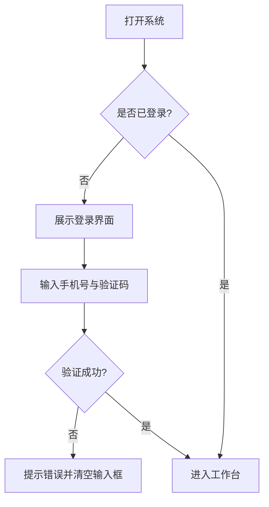

# 敏捷产品经理需求产出工作流 (Agile PM Workflow)
## 触发方式
当用户提供一个初步的想法或需求描述时，请严格按照以下**七个步骤**引导用户。
**🚨 绝对强制指令：你必须一步一步（Step-by-Step）执行！绝不允许一次性输出所有步骤的结果。在每一个带有【等待用户确认】的步骤结束后，你必须停止输出，等待用户的回答！**

---

## 步骤一：对话式需求采集与确认

新手往往难以一次性说清需求。AI 应首先采用「灵活对话式」引导，主动评估、温和追问、并进行总结确认。在需求未明确前，**不要急于创建文件或文件夹**。

### 1.1 接收需求
- 接受用户的任意形式输入（一句话、截图、草图、大白话）。
- **不要**要求用户填写复杂的固定模板，降低认知门槛。

### 1.2 核心维度评估与反馈
当你接收到用户的初步需求后，**必须将以下 7 个关键维度的评估结果直接展示给用户**，告诉他们当前需求在哪些维度是清晰的，哪些是缺失的：
1. **背景/痛点**：为什么要做？现状有什么问题？（必须）
2. **业务目标**：做完后想达到什么效果？（必须）
3. **用户与场景**：谁在什么具体情况下使用？（必须）
4. **核心用户旅程**：用户从接触到完成目标的关键路径是怎样的？中间有什么触点和痛点？（必须）
5. **现有方案**：现在他们是怎么解决这个问题的？（重要）
6. **业务规则**：有哪些必须遵守的限制或特定流程？（重要）
7. **参考/竞品**：有没有喜欢的对标产品？（加分项）

### 1.3 深度追问与多轮确认 【等待用户确认】
**🚨 关键规则：不要急于总结，必须进行至少 3 轮深度的启发式追问！**
- **追问方式**：抛弃死板的选项（A/B/C），采用**开放式、启发式**的提问，引导用户多方面、更全面地思考这个需求。
- **追问数量**：每次追问必须在 **3 到 5 个问题**之间。
- **循环机制**：基于用户的上一次回答，挖掘出新的盲点继续追问，至少进行 3 轮对话。
- **最终确认**：只有当你通过多轮追问**完全理解**了需求的所有细节，并且用户明确表示"没有补充了，可以开始写了"之后，你才能进行结构化复述并进入下一步。
- **🛑 强制暂停：在每一轮提问后必须停止输出！等待用户回复后才能进行下一轮动作。**

---

## 步骤二：项目初始化与目录架构搭建

在需求确认无误，准备开始产出文档之前，必须先帮用户建立一个清晰、规范的项目文件夹结构，避免后期文件混乱。

### 2.1 建立标准目录树
主动为当前项目创建一个专属的根文件夹（如以项目名称命名），并在其中创建以下标准子目录：
- `prd/`：用于存放所有的产品需求文档（Markdown 格式，如 `prd_v1.0.md`）。
- `prototype/`：用于存放所有的高保真 HTML 原型文件。
- `flowcharts/`：用于存放独立的 Mermaid 流程图源文件（`.mmd`），方便单独维护。PRD 中的流程图直接以 Mermaid 代码块嵌入。
- `annex/`：用于存放各种附件（如原始的 Excel/CSV 数据字典、需求原始文稿、参考资料等）。
- `templates/`：用于存放工作流模板或参考文件（如 `prd_template.md`）。

### 2.2 确认架构
向用户展示创建好的目录结构，并告知后续的产出物都将分类存放在这些对应的文件夹中。

---

## 步骤三：输出"详细的第一版初步PRD"

**🚨 关键规则：初步的 PRD 也必须非常详细，不能只是一个空框架。**

### 3.1 产出内容（单一 Markdown 格式）
根据步骤一的确认信息，生成一份初步 PRD（`prd/prd_v1.0.md`，Markdown 格式）。

**Markdown 格式的优势**：
- 生成速度快，无需依赖 `python-docx` 或 HTML 渲染。
- 飞书、Notion、语雀、GitHub 等主流知识库均原生支持 Markdown 导入与渲染（含 Mermaid）。
- 纯文本格式，便于版本对比（git diff）和协作编辑。

**必须搭建好完整的文档结构骨架（参考 6.1 节的标准目录），并且必须深度填充以下部分**：
1. **项目基本信息**
2. **需求背景与目标**：必须包含四列表格（目标类型、描述、衡量指标、目标值）。
3. **用户使用场景与旅程图**：必须使用表格或清晰的结构描述用户旅程（User Journey Map），包含：阶段、用户触点、用户行为、痛点/情绪、产品机会点，要具备强烈的代入感。
4. **详细的功能清单与基础逻辑**：不能只列出模块和名称，必须详细梳理出核心的操作主线、前置条件、基本业务规则和数据流向。
*（后续章节如详细方案带原型链接的模块、整体流程图等可先留空，并注明"待原型确认后补充"）*

### 3.2 用户确认 【等待用户确认】
询问用户："这是产品的详细第一版架构和业务逻辑，您看方向和基础逻辑准确吗？如果没问题，我们将先进行【原型设计】，通过具体的画面来进一步理清交互细节和可能遗漏的功能。"
**🛑 强制暂停：在此处必须停止输出！等待用户回复同意后，才能进入步骤四。**

---

## 步骤四：产出高保真 HTML 原型 (核心验证阶段)

**这是本工作流最具特色的环节。** 新手往往在看到具体画面后，才能发现逻辑上的漏洞（如缺失的返回按钮、未考虑的空状态）。

### 4.1 原型规范
1. 产出 **单文件 HTML 原型**，包含完整的 CSS 样式。
2. 强制使用 **Tailwind CSS**，并采用现代、简洁的设计风格。
3. 必须包含关键的交互状态（如：默认页、展开弹窗、成功提示等）。可以通过简单的原生 JavaScript 或 URL Hash (`#page1`) 来实现页面切换。
4. **Hash 路由定位**：原型必须支持 URL Hash 路由（如 `prototype_v1.0.html#login`），方便 PRD 中通过链接直接跳转到对应功能页面。

### 4.2 设计系统生成与前端设计优化（双重保障）

本工作流采用**两阶段设计流程**，确保从设计方向到视觉细节的全面专业化：
- **第一阶段（UI/UX Pro Max）**：确定设计方向、风格、配色、字体等核心设计系统
- **第二阶段（Impeccable Skills）**：对生成的 HTML 原型进行专业级打磨和细节优化

#### 4.2.1 第一阶段：UI/UX Pro Max 设计系统生成（必须执行）

在原型开发前，必须执行以下命令获取完整的设计系统推荐：

```bash
python3 ~/.claude/skills/ui-ux-pro-max/scripts/search.py "<产品类型> <行业> <关键词>" --design-system -p "项目名称"
```

**示例**：
```bash
# 美容 SPA 服务类产品
python3 ~/.claude/skills/ui-ux-pro-max/scripts/search.py "beauty spa wellness service" --design-system -p "Serenity Spa"

# AI 搜索工具产品
python3 ~/.claude/skills/ui-ux-pro-max/scripts/search.py "AI search tool modern minimal" --design-system -p "AI Search"

# 金融科技产品
python3 ~/.claude/skills/ui-ux-pro-max/scripts/search.py "fintech crypto trading" --design-system -p "CryptoTrade"
```

**设计系统输出包含**：
1. **产品模式推荐**：基于产品类型的最佳设计模式
2. **风格选择**：从 67 种 UI 风格中匹配（glassmorphism、minimalism、brutalism 等）
3. **色彩方案**：从 161 个色板中推荐适合的配色（含 Tailwind CSS 类名）
4. **字体配对**：从 57 组字体配对中推荐（含 Google Fonts 导入代码）
5. **视觉效果**：阴影、模糊、圆角等效果参数
6. **反模式警告**：需要避免的设计陷阱

#### 4.2.2 补充领域搜索（按需执行）
如需深入某个设计维度，可使用领域搜索：

```bash
# 获取更多风格选项
python3 ~/.claude/skills/ui-ux-pro-max/scripts/search.py "glassmorphism dark" --domain style

# 获取 UX 最佳实践
python3 ~/.claude/skills/ui-ux-pro-max/scripts/search.py "animation accessibility" --domain ux

# 获取图表推荐
python3 ~/.claude/skills/ui-ux-pro-max/scripts/search.py "real-time dashboard" --domain chart

# 获取 React Native 性能优化
python3 ~/.claude/skills/ui-ux-pro-max/scripts/search.py "list performance navigation" --stack react-native
```

**可用领域**：`product`、`style`、`typography`、`color`、`landing`、`chart`、`ux`、`google-fonts`、`react`、`web`、`prompt`

#### 4.2.3 设计系统持久化（可选）
如需跨会话保存设计系统，添加 `--persist` 参数：

```bash
python3 ~/.claude/skills/ui-ux-pro-max/scripts/search.py "<查询>" --design-system --persist -p "项目名称"
```

这将创建：
- `design-system/MASTER.md` — 全局设计规范
- `design-system/pages/` — 页面级设计覆盖

#### 4.2.4 原型实现阶段
基于设计系统推荐，使用 Tailwind CSS 实现原型时：
1. 严格遵循推荐的色彩方案（使用推荐的 Tailwind 类名）
2. 应用推荐的字体配对（复制 Google Fonts 导入代码）
3. 实现推荐的视觉效果（阴影、圆角、模糊等）
4. 参考 UX 快速参考清单（10 大优先级类别）
5. 避免设计系统中标注的反模式

**注意**：UI/UX Pro Max Skill 已集成到本工作流，无需额外安装。如需单独使用，请参考 `~/.claude/skills/ui-ux-pro-max/skill.md`。

#### 4.2.5 第二阶段：Impeccable Skills 前端设计打磨（必须执行）

在基于设计系统完成 HTML 原型初稿后，**必须调用 Impeccable Skills** 进行专业级打磨，确保视觉细节和交互体验达到专业水准。以下是在原型生成后必须依次调用的指令：

1. **布局优化**：调用 `/arrange` 进行布局优化，确保元素间距、对齐和视觉层级合理。
2. **排版优化**：调用 `/typeset` 进行文字排版优化，确保字体大小、行高、字重层级清晰。
3. **配色优化**：调用 `/colorize` 进行配色方案优化，确保颜色对比度、品牌一致性和可访问性。
4. **交互细节**：调用 `/delight` 添加微交互和过渡动效，提升用户体验。
5. **整体打磨**：调用 `/polish` 进行整体视觉打磨，统一细节处理。
6. **质量自查**：调用 `/critique` 进行设计质量自查，识别潜在问题并优化。

**注意**：Impeccable Skills 的 6 个指令必须在原型初稿完成后依次执行，不可跳过。这些指令将在 UI/UX Pro Max 确定的设计方向基础上，进行细节层面的专业打磨。

### 4.3 原型审查与 PRD 双向同步更新 (核心迭代循环) 【等待用户反馈】
- 将生成的 HTML 代码或预览呈现给用户。
- 引导用户思考："看看这个界面，您觉得用户点完这个按钮后，如果网络断了该怎么提示？这里的信息展示够全吗？"
- **🛑 强制暂停：在此处必须停止输出！等待用户反馈修改意见。**
- 根据用户的反馈修改原型。
- **🚨 关键规则（PRD 实时同步）**：每次用户提出对原型的修改（如增加功能、修改交互逻辑、调整页面流转），AI **必须**在修改 HTML 原型的同时，同步更新 Markdown PRD 中对应的"详细方案"章节。不仅要更新逻辑描述，还要确保原型链接（含 Hash 锚点）与最新原型保持一致。
- 只有当用户对原型表示"完全满意"、"可以进入下一步"时，才可进入步骤五。

---

## 步骤五：输出流程图 (Mermaid)

在原型跑通后，业务逻辑已经相对清晰，此时再来画流程图。
1. 使用 **Mermaid** 语法（`flowchart TD` 或 `sequenceDiagram`）。
2. 重点描绘：用户的核心操作主线，以及刚才在原型审查中发现的**异常分支**。
3. 确保代码中没有会导致渲染错误的特殊字符（如未转义的中文括号）。
4. **流程图直接以 Mermaid 代码块嵌入 Markdown PRD**，飞书、Notion、语雀、GitHub 等主流平台均原生支持 Mermaid 渲染，无需导出图片。
5. 如需独立维护流程图源文件（如多个 PRD 共用同一张图），可将 Mermaid 代码保存为 `flowcharts/main_flow.mmd` 等独立文件。

---

## 步骤六：产出最终版 PRD (单一 Markdown 格式)

综合前四步的所有成果，输出最终产品需求文档（`prd/prd_v1.0.md`，覆盖步骤三的初版，补全所有内容）。

### 6.1 文档结构要求
PRD 必须严格遵循以下标准目录结构进行组织：
  1. **项目信息与版本记录**
  2. **一、需求背景** (现状问题、为什么现在做)
  3. **二、需求目标** (目标类型、描述、衡量指标、目标值)
  4. **三、用户与使用场景** (典型用户与 User Journey)
  5. **四、需求功能清单** (骨架与优先级)
  6. **五、详细方案** (每个功能点的交互逻辑、规则描述、原型链接)
  7. **六、业务流程图** (Mermaid 代码块)
  8. **七、异常与边界处理** (断网、空状态、无权限等)
  9. **八、数据追踪与埋点** (可选)
  10. **九、未来演进规划** (Roadmap)
  11. **十、附件** (数据字典/工艺标准等)

### 6.2 Markdown 格式规范
- 标题层级使用 ATX 风格（`#`、`##`、`###`），便于飞书/Notion 自动生成目录。
- 表格使用标准 Markdown 表格语法，列对齐用 `:---:` / `---:` 控制。
- 流程图使用 Mermaid 代码块（` ```mermaid ` ... ` ``` `）。
- 段落之间空一行，列表项之间根据可读性自由换行。
- 文档首页的版本记录表格中标注当前版本号；如需查看历史版本，通过文件名（`prd_v1.0.md`、`prd_v1.1.md`）区分。

### 6.3 详细方案章节设计 (功能模块化展示)
PRD 中的核心部分是"详细方案"。每个功能点必须包含以下三部分，按顺序排列：

1. **交互逻辑流程图**：使用 Mermaid 画出该功能的具体交互分支和异常流转。
2. **详细规则描述**：文字说明触发条件、交互反馈、异常处理（如断网、空数据）。
3. **原型链接（带 Hash 锚点）**：使用 Markdown 链接指向原型文件中对应功能的页面，如：
   - `[👉 查看交互原型 - 用户登录](../prototype/prototype_v1.0.html#login)`
   - 鼓励用户在浏览器中点击链接，直接体验完整交互。

**Markdown 结构示例**：

````markdown
### 5.1 用户登录验证

#### 1. 交互流程图



#### 2. 规则描述

- **触发条件**：用户首次打开系统或 Token 过期时展示。
- **交互反馈**：
  - 点击"获取验证码"后，按钮变灰并倒计时 60s。
  - 手机号未填满 11 位时，登录按钮处于禁用状态（不可点击）。
- **异常处理**：
  - 验证码错误：Toast 提示"验证码错误，请重新输入"。
  - 无网络：Toast 提示"网络未连接，请检查网络设置"。

#### 3. 原型演示

[👉 查看交互原型 - 用户登录](../prototype/prototype_v1.0.html#login)
````

### 6.4 交付检查
- [ ] Markdown 版 PRD 已生成（`prd/prd_v1.0.md`）。
- [ ] 包含了清晰的**用户旅程图**（User Journey Map）。
- [ ] 详细方案中，每个功能点都有对应的 **Mermaid 流程图**。
- [ ] 详细方案中，每个功能点都有指向原型对应页面的 **Markdown 链接**（含 Hash 锚点）。
- [ ] 异常情况（断网、空数据、权限不足）已被补充到文档中。
- [ ] Markdown 文档可正常导入飞书 / Notion / 语雀，标题层级和 Mermaid 流程图渲染无误。

---

## 步骤七：版本迭代与管理 (Version Control)

当项目进入后续迭代阶段（例如从 `v1.0` 升级到 `v1.1`）时，必须执行严格的结构化版本控制，确保历史可追溯，且不破坏过往版本。

### 7.1 文件物理隔离与复制
- **绝对不要直接覆盖历史版本**。
- 在进行 `v1.1` 迭代时，需进入 `prd/` 和 `prototype/` 文件夹，将上一版本的所有文件复制并重命名：
  - `prd_v1.0.md` → `prd_v1.1.md`
  - `prototype_v1.0.html` → `prototype_v1.1.html`
- 同时更新 `flowcharts/` 中有变动的独立流程图源文件（可按版本号建子目录，如 `flowcharts/v1.1/`）。
- 后续所有的修改仅在 `v1.1` 文件中进行，保留 `v1.0` 作为历史快照。

### 7.2 变更日志与原型链接联动
- 在新版 PRD 的【版本记录】表格中，详细记录本次迭代新增、修改或下线的具体功能点。
- **原型链接同步**：在 `prd_v1.1.md` 中，所有原型链接路径必须统一修改指向 `../prototype/prototype_v1.1.html#功能名`，确保文档和原型版本严谨对应。
- **历史版本提示（可选）**：如有需要，可在 `prd_v1.0.md` 顶部添加一行 Markdown 提示，引导读者查看最新版：
  > ⚠️ 您正在查看历史版本 v1.0，[点击此处前往最新版 v1.1](./prd_v1.1.md)
